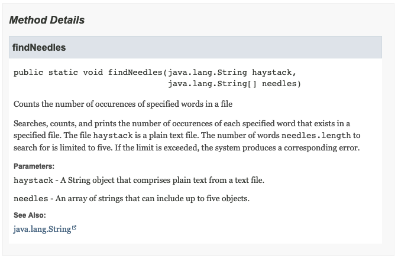

.. raw:: pdf

   PageBreak

.. _api-ref:

=========================
Exercise #1 — findNeedles
=========================

API reference
=============

Sample code snippet with doc comments that include method description followed
by block tags:

.. code-block:: java

   /**
   * Counts the number of occurences of specified words in a file
   * 

   * Searches, counts, and prints the number of occurences of each specified
   * word that exists in a specified file. The file (haystack) is a plain text
   * file. The number of words (needles.length) to search for is limited to
   * five. If the limit is exceeded, the system produces a corresponding error.
   *
   * @param haystack A String object that comprises plain text from a text file.
   * @param needles An array of strings that can include up to five objects.
   * @see <a
   *     href="https://docs.oracle.com/en/java/javase/15/docs/api/java.base/java/lang/String.html">
   *     java.lang.String</a>
   */

   public static void findNeedles(String haystack, String[] needles) {
   if(needles.length > 5) {
     System.err.println("Too many words!");
     }

   else {
     int[] countArray = new int[needles.length];
     for(int i = 0; i < needles.length; i++) {
       String[] words = haystack.split("[ \"\'\t\n\b\f\r]", 0);
       for(int j = 0; j < words.length; j++) {
         if(words[j].compareTo(needles[i]) == 0) {
           countArray[i]++;
           }
         }
       }

     for (int j = 0; j < needles.length; j++) {
       System.out.println(needles[j] + ": " + countArray[j]);
       }
     }

API reference for the ``findNeedles`` method generated by the Javadoc tool:

Questions and suggestions
=========================

* That would be nice to add comments inside the ``else`` and ``for`` blocks.
  For example:

  .. code-block:: java

     else {
       //Assigns the number of needles to an array of integers countArray
       int[] countArray = new int[needles.length];
       for(int i = 0; i < needles.length; i++) {
         //Creates an array of Strings spliting the haystack text
         String[] words = haystack.split("[ \"\'\t\n\b\f\r]", 0);
         for(int j = 0; j < words.length; j++) {
           //Compares every word from haystack to the needle
           if(words[j].compareTo(needles[i]) == 0) {
             //Increments the counter for each match
             countArray[i]++;
             }

* The error wording could be more user-friendly. For example:

  .. code-block:: java

     System.err.println("I can only search up to 5 words at a time")

* Why would you hardcode this limit of ``needles.length`` ? Why 5?
* The ``haystack`` file is being split in a for-loop for each new ``needle``.
  I think it would make more sense to create an array of Strings from
  distinct words from a given file once, and then just pass it to the
  method. A separate method for this task invoked before ``findNeedles``
  could be a good solution.
